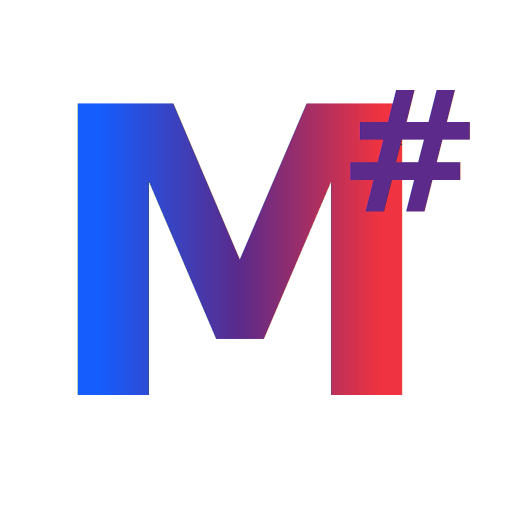

<h1 align="center">
  BluePad
</h1>

  <strong>A fast, lightweight Markdown editor for Windows.</strong> 
  Built with Tauri instead of Electron — tiny, native, and respectful of your CPU.

  
  
  

  <a href="https://bluepad.work">Website</a> ·
  <a href="https://bluepad.work/en/blog/">Blog</a> ·
  <a href="https://bluepad.work/help/">Help</a> ·
  <a href="https://bluepad.work/feedback/">Feedback</a>

  

---

## Why BluePad?

Most Markdown editors fall into one of two camps:

1. **Web-tech bloat** — Electron apps that eat 500MB+ of RAM just to render text.
2. **Bare-bones text** — Vim/Emacs/Notepad++ with Markdown plugins that don't truly render the document.

BluePad sits in between: a native Windows app written in **Rust + Tauri**, with a real WYSIWYG editor on top. It opens in under a second, uses ~80MB of RAM, and ships as a ~7MB installer.

If you write Markdown daily and resent that your editor takes longer to boot than your IDE, this is for you.

---

## Features

### ✍️ Writing
- **WYSIWYG + Source Mode** — Toggle with `Ctrl+/`
- **Multi-Tab** — Drag-to-reorder; tabs restore on restart
- **Find & Replace** — `Ctrl+F` / `Ctrl+H`
- **Focus Mode** — Distraction-free fullscreen (Pro)
- **Auto-Save** — Every 30 seconds, never lose work

### 🎨 Rendering
- **5 Themes** — Classic, Dark (free), BRP Blue, Red, Polarity (Pro)
- **KaTeX Math** — `$inline$` and `$$block$$`
- **Mermaid Diagrams** — Flowcharts, sequence diagrams, etc.
- **Syntax Highlighting** — 200+ languages via Prism
- **YAML Front Matter** — First-class display
- **`[toc]` Auto-generation** — Drop in a token, get a TOC

### 🗂 Files
- **File Tree Sidebar** — Browse and open a folder
- **JSON / YAML Editing** — Highlight + auto-format (`Ctrl+Shift+F`)
- **Drag & Drop** — Drop files onto window to open

### ⚙️ App
- **Always on Top** — Pin window above everything
- **3 Languages** — English, Korean, Japanese (auto-detect)
- **Auto-Update** — Built-in updater, signed releases
- **14-Day Pro Trial** — No signup, no card

---

## Free vs Pro

| Feature | Free | Pro ($10.99 lifetime) |
|---------|:----:|:----:|
| Tabs | 3 | Unlimited |
| Themes | Classic + Dark | All 5 |
| Focus Mode | — | ✅ |
| HTML/PDF Export | — | ✅ |
| JSON/YAML | ✅ | ✅ |
| LaTeX / Mermaid | ✅ | ✅ |
| Find & Replace | ✅ | ✅ |
| Always on Top | ✅ | ✅ |
| Updates | ✅ | ✅ |

**One-time payment.** Works on 3 devices. No subscription, no telemetry, no nagging.

---

## Quick Start

1. Download the MSI from [bluepad.work](https://bluepad.work).
2. Run it. Windows SmartScreen may warn (no code signing certificate yet — see [#code-signing](#a-note-on-code-signing)). Click **More info → Run anyway**.
3. Open it. The first 14 days unlock all Pro features automatically.

That's it. No account, no setup wizard.

---

## Keyboard Shortcuts

| Shortcut | Action |
|----------|--------|
| `Ctrl+N` | New file |
| `Ctrl+O` | Open file |
| `Ctrl+S` | Save |
| `Ctrl+Shift+S` | Save As |
| `Ctrl+W` | Close tab |
| `Ctrl+Tab` | Next tab |
| `Ctrl+/` | Toggle source mode |
| `Ctrl+F` | Find |
| `Ctrl+H` | Replace |
| `Ctrl+Shift+F` | Format JSON/YAML |
| `Ctrl+= / Ctrl+- / Ctrl+0` | Font size |
| `F11` | Focus mode (Pro) |

---

## Tech Stack

| Layer | Tech |
|-------|------|
| Desktop shell | [Tauri v2](https://tauri.app) (Rust + system WebView) |
| Frontend | React 18 + TypeScript + Vite |
| Editor core | [Milkdown](https://milkdown.dev) (ProseMirror) + [CodeMirror 6](https://codemirror.net) |
| Math | [KaTeX](https://katex.org) |
| Diagrams | [Mermaid](https://mermaid.js.org) |
| Backend | Cloudflare Workers + D1 + R2 |
| Landing | Cloudflare Pages |

The whole installer is ~7MB. The running app uses ~80MB of RAM with one document open. (For reference, an Electron-based editor like Boost Note baseline is ~200-300MB.)

---

## Comparison

| | BluePad | Typora | Obsidian | Notepad++ |
|---|:---:|:---:|:---:|:---:|
| Install size | **7MB** | 90MB | 150MB | 5MB |
| RAM (idle) | **80MB** | 200MB | 400MB | 30MB |
| Native Windows | ✅ | ✅ | (Electron) | ✅ |
| WYSIWYG | ✅ | ✅ | Partial | ❌ |
| Free tier | ✅ (limited) | 15-day trial | ✅ | ✅ |
| One-time price | **$10.99** | $14.99 | Free (paid sync) | Free |
| Mermaid + KaTeX | ✅ | ✅ | ✅ (plugin) | ❌ |
| Plugin ecosystem | ❌ | ❌ | ✅ | ✅ |
| Mobile / sync | ❌ | ❌ | ✅ (paid) | ❌ |

BluePad is **deliberately small in scope.** If you need plugins, mobile sync, or a vault graph, use Obsidian. If you need an absolutely minimal text editor, use Notepad++. If you want a fast native Markdown writer with sensible defaults — that's BluePad.

---

## A Note on Code Signing

BluePad is **not yet signed with a commercial code-signing certificate**. The first time you run it, Windows SmartScreen will say "Unrecognized publisher."

This is normal for indie software. To run anyway:

1. Click **"More info"** on the SmartScreen dialog.
2. Click **"Run anyway"**.

I'll get an OV certificate once revenue justifies the ~$200/year cost (or I'll qualify for the [SignPath OSS Foundation program](https://signpath.org/foundation) once BluePad gains more visibility).

The MSI is, however, signed by Tauri's own updater key (used to verify auto-updates), and all binary artifacts are reproducible from the source.

---

## Privacy

- **No telemetry**, no analytics, no usage tracking inside the app.
- The website uses Microsoft Clarity for visitor analytics, but the app itself does not phone home except to check for updates and to validate a Pro license (if entered).
- Pro license validation sends only your license key + a hashed device ID to verify the activation. **No content, no filenames, no IP-based geolocation in app.**
- Full [Privacy Policy](https://bluepad.work/legal/privacy).

---

## Made by

**BRP (BlueRedPolarity)** — solo indie dev based in South Korea.

- Email: blueehdwp@gmail.com
- Website: https://bluepad.work
- Issues / feature requests: [feedback form](https://bluepad.work/feedback/)

Built nights and weekends. PRs are not currently accepted (closed-source), but **bug reports and feature requests are very welcome.**

---

  If BluePad helps your writing flow, consider buying the $10.99 Pro license — it directly funds development.

