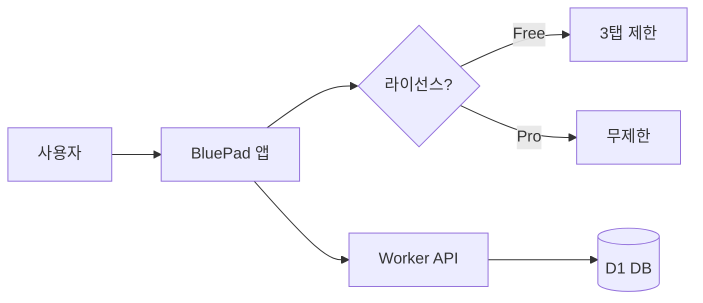
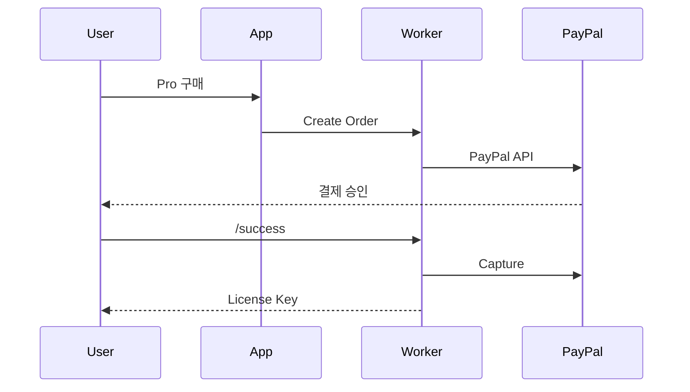

# 마크다운 렌더링 테스트

## 1. 제목 (Headings)

# H1 제목
## H2 제목
### H3 제목
#### H4 제목
##### H5 제목
###### H6 제목

## 2. 텍스트 서식 (Text Formatting)

**굵게 (Bold)** 텍스트입니다.

*기울임 (Italic)* 텍스트입니다.

~~취소선 (Strikethrough)~~ 텍스트입니다.

***굵은 기울임*** 텍스트입니다.

`인라인 코드 (inline code)` 텍스트입니다.

일반 텍스트 안에 **굵게**, *기울임*, ~~취소선~~, `코드`가 섞여 있습니다.

## 3. 링크 & 이미지 (Links & Images)

[BluePad 홈페이지](https://bluepad.work)

[이메일 링크](mailto:blueehdwp@gmail.com)


## 4. 목록 (Lists)

### 비순서 목록
- 항목 1
- 항목 2
  - 중첩 항목 2-1
  - 중첩 항목 2-2
    - 3단계 중첩
- 항목 3

### 순서 목록
1. 첫 번째
2. 두 번째
   1. 중첩 순서 2-1
   2. 중첩 순서 2-2
3. 세 번째

### 체크리스트 (Task List)
- [x] 완료된 항목
- [x] 이것도 완료
- [ ] 미완료 항목
- [ ] 이것도 미완료

## 5. 인용구 (Blockquote)

> 단일 인용구입니다.

> 여러 줄 인용구
> 두 번째 줄
> 세 번째 줄

> 중첩 인용구
>> 2단계 인용
>>> 3단계 인용

## 6. 코드 블록 (Code Blocks)

### JavaScript
```javascript
function greet(name) {
  const message = `Hello, ${name}!`;
  console.log(message);
  return message;
}

// 호출
greet("BluePad");
```

### Python
```python
def fibonacci(n):
    if n <= 1:
        return n
    return fibonacci(n - 1) + fibonacci(n - 2)

for i in range(10):
    print(fibonacci(i))
```

### Rust
```rust
fn main() {
    let name = "BluePad";
    println!("Hello, {}!", name);

    let numbers: Vec<i32> = (1..=5).collect();
    let sum: i32 = numbers.iter().sum();
    println!("Sum: {}", sum);
}
```

### JSON
```json
{
  "name": "BluePad",
  "version": "1.2.0",
  "features": ["markdown", "json", "yaml"],
  "pro": true
}
```

### YAML
```yaml
name: BluePad
version: 1.2.0
features:
  - markdown
  - json
  - yaml
pro: true
```

### CSS
```css
.editor-content {
  font-family: 'Inter', sans-serif;
  font-size: 15px;
  color: #333;
  line-height: 1.7;
}
```

### Bash
```bash
#!/bin/bash
echo "Building BluePad..."
npm run tauri build -- --bundles msi
echo "Done!"
```

## 7. 표 (Tables)

| 기능 | Free | Pro |
|------|:----:|:---:|
| 기본 편집 | O | O |
| 자동 저장 | O | O |
| 탭 수 | 3개 | 무제한 |
| 테마 | 1개 | 4개 |
| 집중 모드 | X | O |

### 긴 표

| 언어 | 확장자 | 에디터 | 구문 강조 | 자동 정렬 |
|------|--------|--------|-----------|-----------|
| Markdown | .md | Milkdown | O | - |
| JSON | .json | CodeMirror | O | O |
| YAML | .yaml | CodeMirror | O | O |
| Text | .txt | textarea | X | - |

## 8. 수평선 (Horizontal Rules)

위 텍스트

---

아래 텍스트

***

또 아래 텍스트

## 9. LaTeX 수식 (Math)

### 인라인 수식
피타고라스 정리: $a^2 + b^2 = c^2$

오일러 공식: $e^{i\pi} + 1 = 0$

### 블록 수식
$$
\int_{-\infty}^{\infty} e^{-x^2} dx = \sqrt{\pi}
$$

$$
\sum_{n=1}^{\infty} \frac{1}{n^2} = \frac{\pi^2}{6}
$$

## 10. Mermaid 다이어그램





## 11. GFM 확장

### 취소선
~~이 텍스트는 취소되었습니다~~

### 자동 링크
https://bluepad.work

### 체크리스트 (반복 테스트)
- [x] 마크다운 편집
- [x] 파일 관리
- [x] 다국어
- [ ] PDF 내보내기
- [ ] 타자기 모드

## 12. 혼합 서식 (Mixed Formatting)

> **참고**: 이 인용구 안에는 *기울임*과 `인라인 코드`와 [링크](https://bluepad.work)가 있습니다.

1. **첫 번째** 항목에 `코드`가 있음
2. *두 번째* 항목에 ~~취소선~~이 있음
3. 세 번째 항목에 $x^2$ 수식이 있음

| 서식 | 마크다운 | 결과 |
|------|----------|------|
| 굵게 | `**text**` | **text** |
| 기울임 | `*text*` | *text* |
| 취소선 | `~~text~~` | ~~text~~ |
| 코드 | `` `code` `` | `code` |

---

*이 문서는 BluePad의 마크다운 렌더링을 테스트하기 위해 작성되었습니다.*
