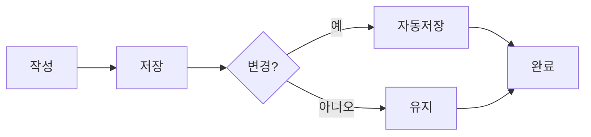
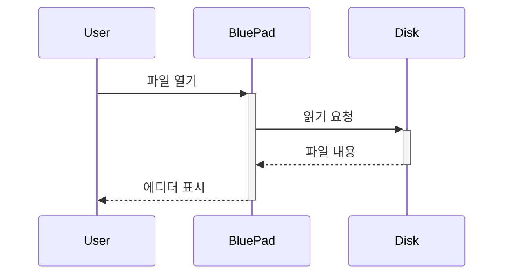

Front Matter

```
title: BluePad 샘플 문서
author: BluePad
date: 2026-05-25
tags: [markdown, sample, demo]
```

***

title: BluePad 샘플 문서
author: BluePad
date: 2026-05-25
tags: \[markdown, sample, demo]
-------------------------------

# BluePad 마크다운 샘플

BluePad가 지원하는 마크다운 기능을 한눈에 보여주는 데모 문서입니다.

\[toc]

Table of Contents

* [title: BluePad 샘플 문서 author: BluePad date: 2026-05-25 tags: \[markdown, sample, demo\]](#)
* [BluePad 마크다운 샘플](#)
* [텍스트 강조](#)
* [목록](#)
* [글머리 기호](#)
* [번호 매기기](#)
* [체크리스트](#)
* [인용](#)
* [코드 블록](#)
* [표](#)
* [수식 (KaTeX)](#)
* [다이어그램 (Mermaid)](#)
* [이미지](#)
* [수평선](#)
* [각주 스타일 메모](#)

Table of Contents

* [title: BluePad 샘플 문서 author: BluePad date: 2026-05-25 tags: \[markdown, sample, demo\]](#)
* [BluePad 마크다운 샘플](#)
* [텍스트 강조](#)
* [목록](#)
* [글머리 기호](#)
* [번호 매기기](#)
* [체크리스트](#)
* [인용](#)
* [코드 블록](#)
* [표](#)
* [수식 (KaTeX)](#)
* [다이어그램 (Mermaid)](#)
* [이미지](#)
* [수평선](#)
* [각주 스타일 메모](#)

Table of Contents

* [title: BluePad 샘플 문서 author: BluePad date: 2026-05-25 tags: \[markdown, sample, demo\]](#)
* [BluePad 마크다운 샘플](#)
* [텍스트 강조](#)
* [목록](#)
* [글머리 기호](#)
* [번호 매기기](#)
* [체크리스트](#)
* [인용](#)
* [코드 블록](#)
* [표](#)
* [수식 (KaTeX)](#)
* [다이어그램 (Mermaid)](#)
* [이미지](#)
* [수평선](#)
* [각주 스타일 메모](#)

## 텍스트 강조

**굵게**, *기울임*, ~~취소선~~, `인라인 코드`, ==하이라이트==, 그리고 [링크](https://bluepad.work).

## 목록

### 글머리 기호

* 항목 하나

* 항목 둘

  * 중첩 항목

  * 또 다른 중첩

* 항목 셋

### 번호 매기기

1. 첫 번째
2. 두 번째
3. 세 번째

### 체크리스트

* [x] 완료된 작업

* [x] 또 다른 완료

* [ ] 진행 중

* [ ] 대기 중

## 인용

> "단순함은 궁극의 정교함이다."
>
> — 레오나르도 다 빈치

## 코드 블록

```javascript
function greet(name) {
  return `Hello, ${name}!`;
}

console.log(greet("BluePad"));
```

```python
def fibonacci(n):
    if n <= 1:
        return n
    return fibonacci(n - 1) + fibonacci(n - 2)
```

## 표

| 기능            | Free | Pro |
| ------------- | :--: | :-: |
| 기본 편집         |   ✓  |  ✓  |
| 탭 수           |  3개  | 무제한 |
| 테마            |  1개  |  5개 |
| 집중 모드         |   ✗  |  ✓  |
| HTML/PDF 내보내기 |   ✗  |  ✓  |

## 수식 (KaTeX)

인라인 수식: $E = mc^2$

블록 수식:

$$
\int_{-\infty}^{\infty} e^{-x^2} \, dx = \sqrt{\pi}
$$

## 다이어그램 (Mermaid)





## 이미지


## 수평선

***

## 각주 스타일 메모

이 문서는 BluePad의 마크다운 렌더링을 검증하기 위한 종합 샘플입니다. 모든 기능이 정상 표시되면 에디터가 올바로 동작하는 것입니다.
