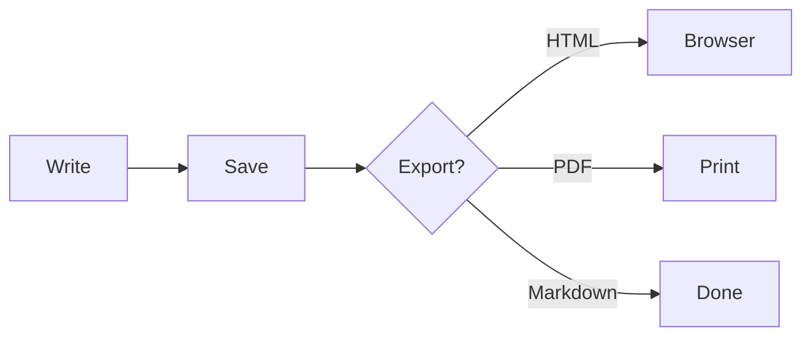

# Welcome to BluePad

A fast, native Markdown editor for Windows.

## What you can do

* **Bold**, *italic*, ~~strikethrough~~, `inline code`

* [Links](https://bluepad.work) and image embedding

* Multi-tab editing with drag-to-reorder

* Auto-save every 30 seconds

## Code blocks with syntax highlighting

```typescript
async function generateLicense(email: string): Promise<License> {
  const key = `BP-${randomSegment(4)}-${randomSegment(4)}-${randomSegment(4)}-${randomSegment(4)}`;
  await db.licenses.insert({ key, email, devices: 3 });
  return { key, devices: 3 };
}
```

## Math via KaTeX

Inline: $E = mc^2$

Block:

$$
\int_{-\infty}^{\infty} e^{-x^2} \, dx = \sqrt{\pi}
$$

## Diagrams via Mermaid



## Tables

| Feature           | Free | Pro |
| ----------------- | :--: | :-: |
| Tabs              |   3  |  ∞  |
| Themes            |   2  |  5  |
| Focus Mode        |   —  |  ✓  |
| HTML / PDF Export |   —  |  ✓  |

***

> "It's the lightweight Markdown editor I always wanted on Windows."
>
> — Made by a solo indie developer who got tired of Electron apps.

